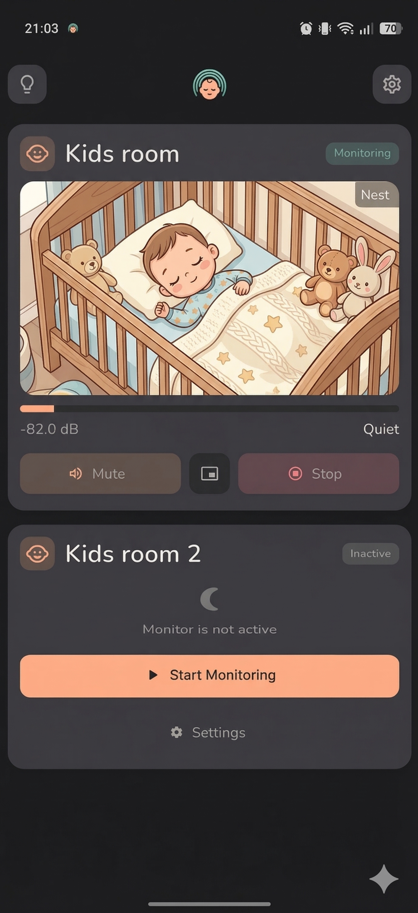
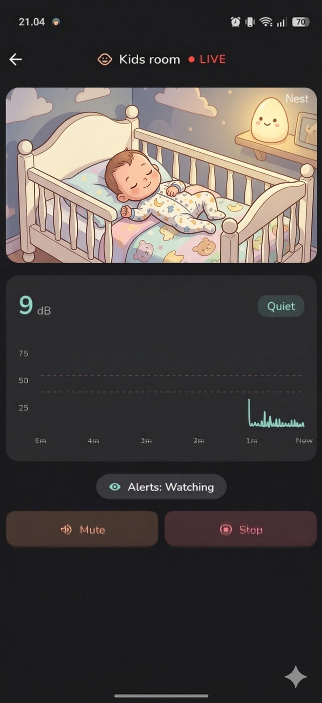
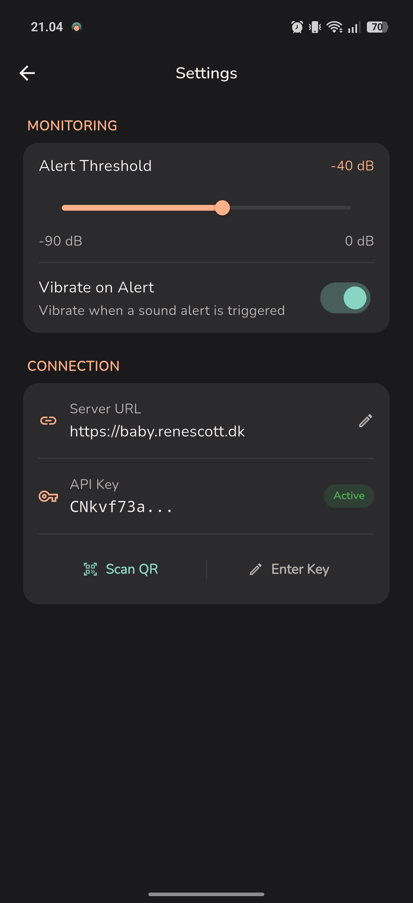

  

<h1 align="center">BabyMonitarr App</h1>

  <strong>The companion mobile app for BabyMonitarr — monitor your baby from anywhere in your home.</strong>
   
  Built with Flutter and WebRTC for real-time, low-latency audio and video streaming directly to your phone.

  <a href="#features">Features</a> •
  <a href="#screenshots">Screenshots</a> •
  <a href="#getting-started">Getting Started</a> •
  <a href="#supported-platforms">Supported Platforms</a> •
  <a href="#tech-stack">Tech Stack</a> •
  <a href="#contributing">Contributing</a>

---

## About

BabyMonitarr App is the mobile client for [BabyMonitarr](https://github.com/Inrego/BabyMonitarr.Backend) — a self-hosted, privacy-first baby monitor. It connects to your BabyMonitarr server and streams audio and video from your IP cameras using **WebRTC**, the same technology behind video calls, delivering near-zero latency right to your device.

**Requires a running [BabyMonitarr Backend](https://github.com/Inrego/BabyMonitarr.Backend) server.**

## Features

- **Low-Latency Streaming** — WebRTC-powered audio and video with millisecond-level latency
- **Multi-Room Dashboard** — Monitor all your rooms at a glance with live video feeds
- **Sound Detection & Alerts** — Configurable audio threshold alerts with vibration and notifications
- **Background Playback** — Keep monitoring even when the app is in the background with a foreground service
- **Picture-in-Picture** — Continue watching the video feed while using other apps (Android & iOS)
- **Keep Screen Awake** — Optional always-on display while monitoring
- **QR Code Setup** — Pair with your server by scanning a QR code from the backend web UI
- **Sound Level Visualization** — Real-time audio level graphs and meters per room
- **Zoomable Video** — Pinch-to-zoom on any camera feed for a closer look

## Screenshots

| Dashboard |                  Monitor Detail                  |               Settings                |
|:-:|:------------------------------------------------:|:-------------------------------------:|
|  |  |  |

## Getting Started

### Prerequisites

- A running **[BabyMonitarr Backend](https://github.com/Inrego/BabyMonitarr.Backend)** server on your local network
- An API key generated from the backend web UI (API Keys page)

### Setup

1. Install the app on your device
2. Open the app and choose your setup method:
   - **QR Code** — Scan the QR code shown in the backend web UI (recommended)
   - **Manual** — Enter your server URL and API key manually
3. Your monitors will appear on the dashboard automatically

## Supported Platforms

| Platform | Status |
|----------|--------|
| Android | Fully supported |
| iOS | Fully supported |
| Windows | Partial support |

Built with **Flutter** for cross-platform development from a single codebase.

## Tech Stack

| Component | Technology |
|-----------|-----------|
| Framework | **Flutter** |
| Streaming | **WebRTC** (near-zero latency peer-to-peer) |
| Signaling | **SignalR** (WebSocket) |
| State | Provider |
| Storage | flutter_secure_storage |

## Contributing

Contributions are welcome! Whether it's bug reports, feature requests, or pull requests — all help is appreciated.

1. Fork the repository
2. Create your feature branch (`git checkout -b feature/amazing-feature`)
3. Commit your changes (`git commit -m 'Add amazing feature'`)
4. Push to the branch (`git push origin feature/amazing-feature`)
5. Open a Pull Request

## Disclaimer

This project is 100% AI-written code. However, the author is an experienced developer — prompts were crafted with deliberate architectural decisions, not blind copy-paste.

## License

[MIT](LICENSE)
